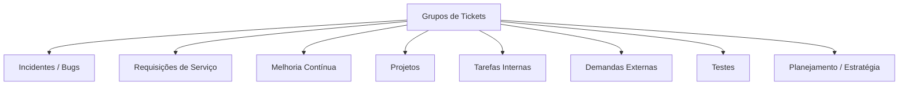
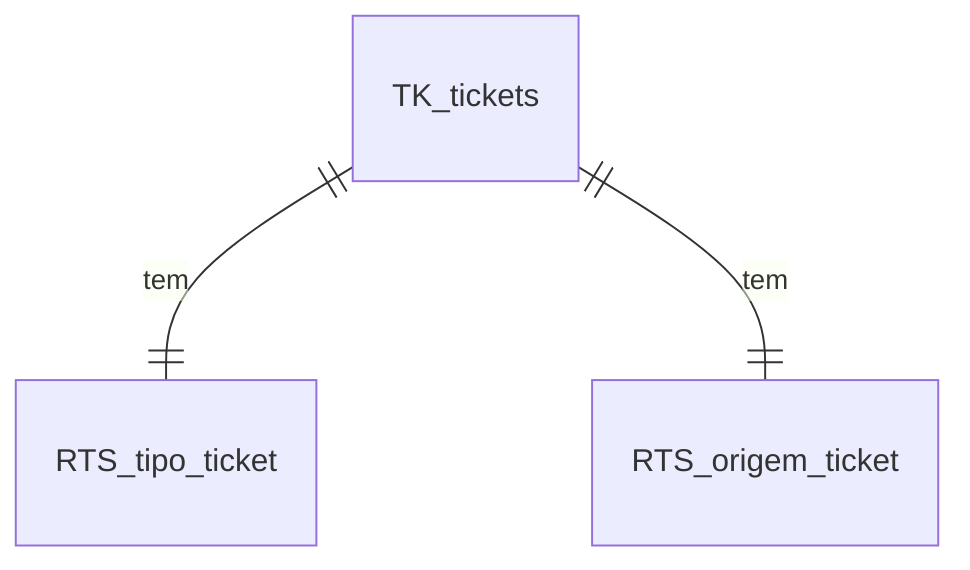

## 🎯 **Objetivo do Grupo**

A ideia do campo `grupo_id` é classificar o **tipo macro** do ticket — ou seja, **qual é a natureza da demanda**, independente do status, prioridade ou responsável. Isso te permite criar painéis separados, filtros inteligentes e até alertas automáticos.

---

## 💡 Sugestões de Grupos (ENUM conceitual)

Vamos ver isso com uma visualização `mermaid` tipo lista enumerada:



Agora vamos detalhar cada grupo com propósito e exemplo:

| Nome do Grupo        | Descrição                                                             | Exemplos                                                 |
| -------------------- | --------------------------------------------------------------------- | -------------------------------------------------------- |
| `Incidente` ou `Bug` | Algo que *quebrou*, precisa correção imediata.                        | "Erro 500 na tela de login", "Sistema não salva dados"   |
| `Requisição`         | Pedido de serviço novo, mas não é bug nem melhoria.                   | "Criar novo usuário", "Instalar ferramenta X"            |
| `Melhoria`           | Algo que já existe mas pode ser otimizado.                            | "Aumentar performance da API", "Melhorar layout de tela" |
| `Projeto`            | Demanda maior, com entregas em fases ou várias tarefas relacionadas.  | "Implantar nova API", "Refatoração geral do módulo Y"    |
| `Tarefa Interna`     | Tarefas administrativas ou rotinas operacionais.                      | "Backup semanal", "Organizar documentação"               |
| `Demanda Externa`    | Algo vindo de cliente, fornecedor ou outro time.                      | "Solicitação do time financeiro", "Cliente pediu ajuste" |
| `Teste`              | Atividades de QA, homologações e validações.                          | "Testar novo deploy", "Homologar nova versão do app"     |
| `Planejamento`       | Ticket criado para registrar ações de análise, arquitetura, decisões. | "Definir arquitetura do projeto Z", "Criar roadmap 2025" |

---

## 🧠 Insight adicional: separar tipo x origem

Você pode eventualmente separar *"tipo do ticket"* (bug, tarefa, melhoria, etc) e *"origem da demanda"* (projeto, suporte, externo...), mantendo os dois como tabelas distintas:



Ou seja:

* `tipo_ticket`: Bug, Melhoria, Tarefa, Projeto, etc
* `origem_ticket`: Interno, Cliente, Suporte, Estratégico, etc

Isso te dá muito mais poder de segmentação.

---

## ✅ Sugestão prática para sua tabela `RTS_grupo` (ENUM-like)

Você pode preencher com algo assim:

```sql
INSERT INTO RTS_grupo (id, nome)
VALUES
  (1, 'Incidente'),
  (2, 'Requisição'),
  (3, 'Melhoria'),
  (4, 'Projeto'),
  (5, 'Tarefa Interna'),
  (6, 'Demanda Externa'),
  (7, 'Teste'),
  (8, 'Planejamento');
```

---

## 📊 Exemplo de filtro no Grafana ou painel web:

```sql
SELECT COUNT(*) AS total, g.nome AS grupo
FROM TK_tickets t
JOIN RTS_grupo g ON g.id = t.grupo_id
WHERE t.excluido = FALSE
GROUP BY g.nome
ORDER BY total DESC;
```

---

## 🔁 Quer evoluir?

Você pode também usar `subgrupos` para detalhamento mais fino. Por exemplo:

* Grupo: `Projeto`
  * Subgrupo: `Desenvolvimento`, `Migração`, `Implantação`
* Grupo: `Requisição`
  * Subgrupo: `Usuário`, `Infraestrutura`, `Processo`

---

## 📚 Fontes de referência e prática:

* ITIL: [https://www.axelos.com/certifications/itil-service-management](https://www.axelos.com/certifications/itil-service-management)
* Gestão de chamados (Jira, GLPI, OTRS): análise própria com base em documentação dos produtos
* Prática de DevOps e Service Desk

---